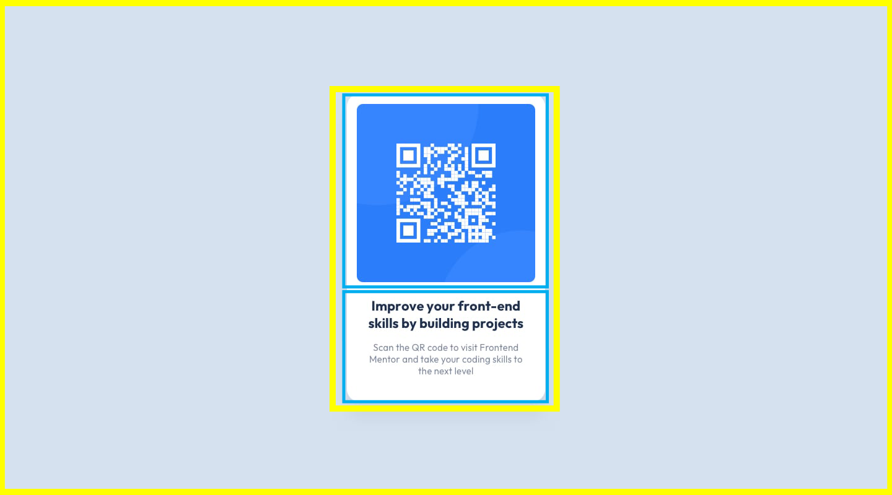

### Links

- Solution URL: (https://www.frontendmentor.io/challenges/qr-code-component-iux_sIO_H/hub/solution-to-qr-code-component-using-css-grid-N9KiClWSfk)
- Live Site URL: (https://smgy94.github.io/front-end-mentor-projects/qr-code-component-main/)

# Frontend Mentor - QR code component solution

This is a solution to the [QR code component challenge on Frontend Mentor](https://www.frontendmentor.io/challenges/qr-code-component-iux_sIO_H). Frontend Mentor challenges help you improve your coding skills by building realistic projects.

## Table of contents

- [Links](#links)
- [Overview](#overview)
- [Screenshot](#screenshot)
- [My process](#my-process)
- [Built with](#built-with)
- [Author](#author)

### Screenshot

## My process

I started by opening the design in Adobe Photoshop. I began to break the design down into seperate components.

1. 'outer-container' to center the card component on the page

2. 'card-container' to contain all of the cards elements.

I used yellow / blue boxes so that I could easily visualise the design layout.

I then decided to CSS Grid to control the positioning of the card compenent and it's elements.

### Built with

- Semantic HTML5 markup
- CSS custom properties
- CSS Grid

## Author

- Frontend Mentor - [@Smgy94](https://www.frontendmentor.io/profile/Smgy94)
- LinkedIn - (https://www.linkedin.com/in/shanemcgeown/)
- Twitter - (https://twitter.com/ShaneMcGeown94)
